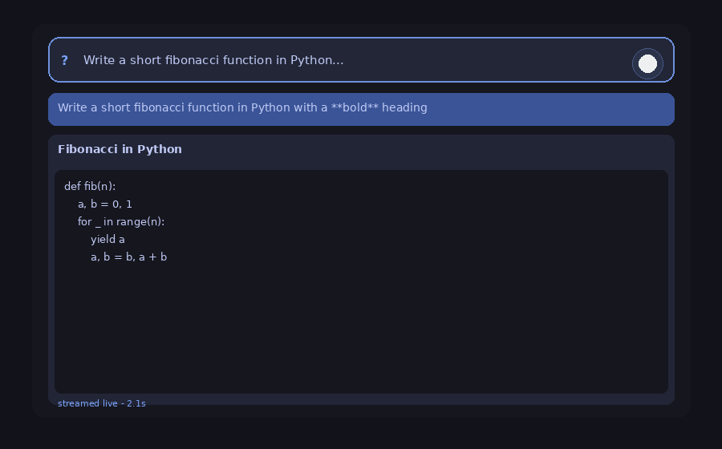

# ✦ hermes-spotlight

**A minimal, transparent Spotlight-style AI launcher for the Linux desktop.**

Press `Super+Space`, ask anything — your local [hermes-agent](https://github.com/NousResearch/hermes-agent) answers with live streaming, tool-call status and Markdown rendering, in a slim translucent bar that feels native to your desktop.



## Why

Raycast-style AI launchers are great — but Mac-only and closed-source. On Linux there was nothing that turns a **local, tool-using AI agent** into a one-keystroke overlay. hermes-spotlight does exactly that: it talks to your local Hermes gateway API server, so it has the **same agent, memory, skills, and tools** as your CLI and desktop app sessions. Ask in the spotlight, continue in the app — the conversation is shared.

- 🖥️ **100% local** — talks only to `127.0.0.1:8642`, no cloud, no telemetry
- ⚡ **Fast** — starts as a single search bar, ~0.3s, no Electron
- 🎨 **3 themes** — Tokyo Night, Midnight, Rose Pine (or add your own)
- 📋 **Markdown answers** — code blocks, bold, lists, links; text is selectable
- 🔄 **Live streaming** — answer text streams in, tool calls show as `⚙ terminal: …`
- 🧠 **Session memory** — the conversation survives closing, reboots
- ⌨️ **Quality of life** — input history (↑/↓), `/new`, `/stop`
- 🪟 **Logo button** — jump straight to the full Hermes desktop app

## Requirements

- Linux with a desktop session (COSMIC, GNOME, KDE, anything — Wayland or X11)
- `python3` with PyGObject + GTK4:
  - Arch / CachyOS: `sudo pacman -S python-gobject gtk4`
  - Debian / Ubuntu: `sudo apt install python3-gi gir1.2-gtk-4.0`
  - Fedora: `sudo dnf install python3-gobject gtk4`
- [hermes-agent](https://github.com/NousResearch/hermes-agent) with the gateway running locally

## Install

```bash
git clone https://github.com/LordHayne/hermes-spotlight.git
cd hermes-spotlight
./install.sh
```

The installer:

1. Checks Python + PyGObject + GTK4
2. Enables the gateway's local API server and generates an API key if missing
3. Installs `hermes-spotlight` to `~/.local/bin` + an app-menu entry
4. Binds **Super+Space** automatically on COSMIC and GNOME (KDE: creates the shortcut, enable once in System Settings)

On COSMIC the shortcut activates after the next login. GNOME is instant.

## Configure

Config lives in `~/.config/hermes-spotlight/config.json` (auto-created):

```json
{
  "api_base": "http://127.0.0.1:8642",
  "api_key": "",
  "theme": "tokyo-night",
  "width": 700
}
```

- `api_key` empty → the key is read from `API_SERVER_KEY` in `~/.hermes/.env`
- `theme`: `tokyo-night`, `midnight`, `rose-pine`
- No config needed for the default setup — it just works.

## Bind another key

<details>
<summary>COSMIC</summary>

Edit `~/.config/cosmic/com.system76.CosmicSettings.Shortcuts/v1/custom.ron`:

```ron
{
    (modifiers: [Super], key: "space", description: "Hermes Spotlight"): Spawn("/home/YOU/.local/bin/hermes-spotlight"),
}
```

</details>

<details>
<summary>GNOME</summary>

```bash
gsettings set org.gnome.settings-daemon.plugins.media-keys custom-keybindings "['/org/gnome/settings-daemon/plugins/media-keys/hermes-spotlight/']"
gsettings set org.gnome.settings-daemon.plugins.media-keys.custom-keybinding:/org/gnome/settings-daemon/plugins/media-keys/hermes-spotlight/ name "Hermes Spotlight"
gsettings set org.gnome.settings-daemon.plugins.media-keys.custom-keybinding:/org/gnome/settings-daemon/plugins/media-keys/hermes-spotlight/ command "$HOME/.local/bin/hermes-spotlight"
gsettings set org.gnome.settings-daemon.plugins.media-keys.custom-keybinding:/org/gnome/settings-daemon/plugins/media-keys/hermes-spotlight/ binding "['<Super>space']"
```

</details>

<details>
<summary>KDE</summary>

System Settings → Shortcuts → Add Custom → command `~/.local/bin/hermes-spotlight`, bind `Meta+Space`.

</details>

## Uninstall

```bash
./uninstall.sh
```

(Keeps your config and conversation history — delete `~/.config/hermes-spotlight/` manually if you really want it gone.)

## How it works

```
Super+Space ──▶ hermes-spotlight (GTK4 window, ~200 lines UI)
                    │
                    │  POST /api/sessions/{id}/chat/stream (SSE)
                    ▼
              hermes-agent gateway (127.0.0.1:8642)
                    │  same agent core as CLI / desktop / messaging
                    ▼
              your tools: terminal, files, browser, skills, memory…
```

The gateway API server is an official hermes-agent platform adapter (`gateway/platforms/api_server.py`) — any OpenAI-compatible frontend can talk to it. hermes-spotlight uses the native session endpoints, so spotlight conversations show up in your app/CLI session list with full memory.

## License

MIT — see [LICENSE](LICENSE).

## Credits

Built by [LordHayne](https://github.com/LordHayne) with his AI agent (dogfooding at its finest 🐕). Not affiliated with Nous Research — just a happy user building on top of their excellent agent.