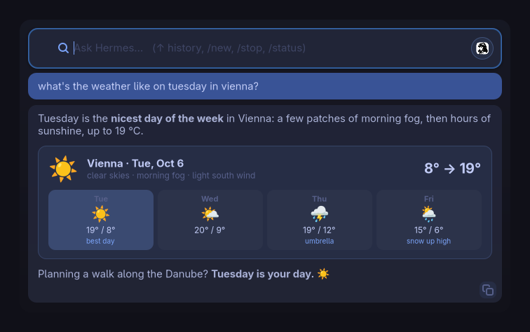
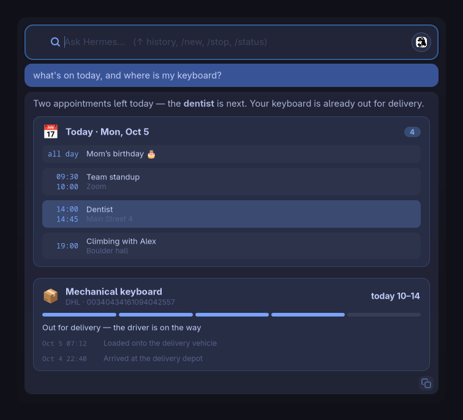
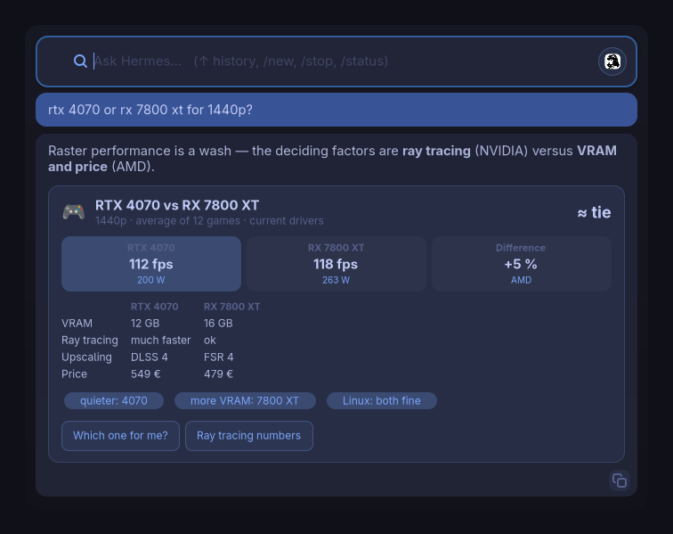
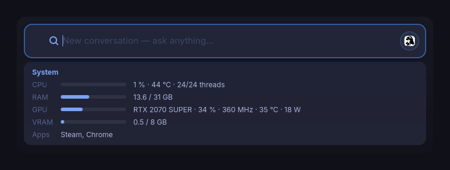
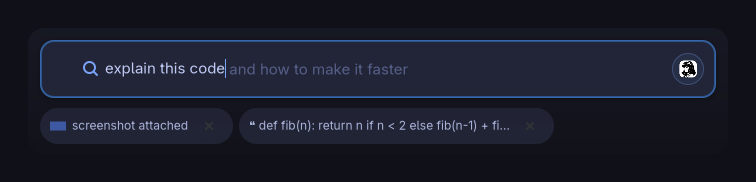

# ✦ hermes-spotlight

**A slim, translucent Spotlight-style bar for the Linux desktop — with a real AI agent behind it.**

Press `Alt+Space`, ask anything — your [hermes-agent](https://github.com/NousResearch/hermes-agent) answers with live streaming, tool-call status, Markdown and native cards, in a bar that feels like your desktop grew it.



## Why

Raycast-style AI launchers are great — but Mac-only and closed-source. On Linux there was nothing that turns a **tool-using AI agent** into a one-keystroke overlay. hermes-spotlight does exactly that: it talks to your Hermes gateway on `127.0.0.1`, so it has the **same agent, memory, skills and tools** as your CLI and desktop app sessions. Ask in the spotlight, continue in the app — the conversation is shared.

**Ask**
- 🔄 **Live answers** — text streams in and is rendered as Markdown while it arrives: code blocks with a copy button, lists, clickable links; tool calls show as `⚙ terminal: …`
- 🌤️ **Native cards** — weather, appointments and package tracking come as cards — and Hermes builds its own cards from a blueprint whenever a table, comparison or stats read better than prose
- 📊 **`/status`** — instant local system card: CPU load/temp, parked cores, RAM, GPU, VRAM, running games — live, no agent round trip
- 🔔 **Background answers** — close the bar while Hermes works; a notification tells you when the answer is ready

**Context**
- ❝ **Highlighted text** — select text anywhere, press `Alt+Space`, ask "explain this"; it shows up as a removable chip
- 📷 **Screenshots** — `Ctrl+V` an image from the clipboard and ask about it
- 🖥️ **Machine context** — the agent knows your OS, CPU, GPU, RAM and running apps, so "why is my game stuttering" gets a real diagnosis

**Do**
- 🚀 **App launcher** — type an app name, Enter starts it; the last row (or `Shift+Enter`) asks Hermes instead
- 🪟 **Hand-off** — the logo button opens the full Hermes desktop app; your spotlight conversation is right there in its session list
- 🧠 **Session memory** — the conversation survives closing and reboots; `/new` starts fresh

**Feel**
- ⚡ **Instant** — stays resident after first use: re-opens in ~30 ms, no Electron
- 👻 **Ghost text** — your most frequent earlier question appears greyed out while you type; `Tab` or `→` takes it
- 🎨 **3 themes** — Tokyo Night, Midnight, Rose Pine (or add your own)

## Cards & context

Some answers deserve more than text. Hermes attaches a small structured
block to answers that fit a card, and the spotlight renders it natively —
the text answer always stays, the card sits next to it.

| Card | Shows | Ask something like |
|---|---|---|
| 🌤️ Weather | conditions, range, day tiles, the nicest day highlighted | "what's the weather on Tuesday?" |
| 📅 Appointments | a day's timeline, the next one highlighted | "what's on today?" |
| 📦 Package | carrier, tracking number, progress, ETA, latest scans | "where is my DHL package?" |



The data comes from the agent, so a card needs a source Hermes can reach —
a weather site, your calendar (e.g. via a calendar skill), a carrier's
tracking page. Whether a card appears also depends on your model following
the format; a broken or missing card never breaks the answer.

### Cards Hermes builds itself

Beyond those three templates, Hermes gets a **blueprint**: a small set of
building blocks it can combine on its own whenever structured data reads
better as a card than as prose — comparisons, specs, rankings, checklists,
stats. Nobody has to write a renderer per topic.



| Block | Renders as |
|---|---|
| `stats` | tiles side by side, one highlighted |
| `bars` | labelled level bars |
| `list` | rows with a lead (time, rank, number) and a subtitle |
| `kv` | key/value pairs |
| `table` | up to 6 columns × 10 rows |
| `progress` | step bar with labels, optional problem state |
| `chips` | tags |
| `text` | a sentence with **bold** / `code` |
| `actions` | buttons: a follow-up question that is sent on click, or an https link |

The blueprint lives in the system message the spotlight sends; Hermes
decides when a card is worth it (at most one per answer). Everything is
rendered as plain text widgets with size limits, unknown blocks are
skipped and links must be https.

`/status` is a card too, but fully local: it never asks the agent, so it
is there in a fraction of a second and refreshes itself while you look.



Context goes in without copy-paste: highlight text anywhere and press
`Alt+Space` — it shows up as a chip and is sent with your question.
`Ctrl+V` attaches a screenshot the same way. While you type, the ghost text
suggests what you asked before.



## Keys & commands

| Key / command | What it does |
|---|---|
| `Alt+Space` | open the bar (again: focus it) |
| `Enter` | launch the selected app, or ask Hermes |
| `Shift+Enter` | always ask Hermes, even when an app matches |
| `Tab` / `→` | accept the ghost-text suggestion |
| `↑` / `↓` | app suggestions, or your question history |
| `Ctrl+V` | attach a screenshot from the clipboard (text pastes as usual) |
| `Ctrl+C` | copy text selected in an answer; with nothing selected, stop a running answer |
| `Esc` | hide the bar — a running answer keeps going in the background |
| `/new` | start a new conversation |
| `/stop` | stop the running answer (the agent is interrupted too) |
| `/status` | local system card |

## The Vision — the assistant every OS is missing

Every desktop OS ships an "AI assistant" that is either a thin chat wrapper (Siri), a cloud bolt-on nobody asked for (Windows Copilot), or nothing at all (most Linux desktops). What's missing everywhere is the same thing: **an assistant that is part of the OS experience — aware of the machine, under your control, and actually able to do things.**

hermes-spotlight is an attempt at that missing layer for Linux:

- **One keystroke, always there.** Not an app you open — an overlay your desktop grows, like Spotlight on macOS. You don't "use" it, you just ask.
- **The agent, not a wrapper.** Behind the bar is a real agent with tools (terminal, files, browser), persistent memory and skills. It doesn't just answer — it executes. Ask it "why is my game stuttering" and it checks your GPU driver state, because it *knows* your OS, GPU, RAM and running apps.
- **Local by architecture.** The widget only talks to your own gateway on `127.0.0.1` — no accounts, no telemetry, no server of ours in between. Where the thinking happens is your choice in Hermes: run a local model and nothing leaves your machine; pick a cloud model and only Hermes talks to it.
- **Native, not Electron.** A single-file GTK4 app, stdlib-only client, no bundled Chromium. It should feel like the desktop grew it.

**Where this goes:** quick answers → app launching → system diagnosis → eventually the place where you handle everything that isn't a full app: "clean my shader cache", "why did that crash", "set up the new drive". The bar stays slim; the agent grows.

The North Star: *the user should never think "I need to open a terminal for this" — asking should always be the shortest path.*

## Requirements

- Linux with a desktop session (COSMIC, GNOME, KDE, anything — Wayland or X11)
- `python3` with PyGObject + GTK4:
  - Arch / CachyOS: `sudo pacman -S python-gobject gtk4`
  - Debian / Ubuntu: `sudo apt install python3-gi gir1.2-gtk-4.0`
  - Fedora: `sudo dnf install python3-gobject gtk4`
- [hermes-agent](https://github.com/NousResearch/hermes-agent) with the gateway running locally

Optional:
- a **vision-capable model** in Hermes for screenshots
- `nvidia-smi` (NVIDIA) or the `amdgpu` driver for GPU values in `/status`
- a color emoji font (e.g. Noto Color Emoji) for the card icons

## Install

```bash
git clone https://github.com/LordHayne/hermes-spotlight.git
cd hermes-spotlight
./install.sh
```

The installer:

1. Checks Python + PyGObject + GTK4
2. Enables the gateway's local API server and generates an API key if missing
3. Installs `hermes-spotlight` to `~/.local/bin` + an app-menu entry
4. Binds **Alt+Space** automatically on COSMIC and GNOME (KDE: see below)

On COSMIC the shortcut activates after the next login. GNOME is instant.

## Configure

Config lives in `~/.config/hermes-spotlight/config.json` (auto-created):

```json
{
  "api_base": "http://127.0.0.1:8642",
  "api_key": "",
  "theme": "tokyo-night",
  "width": 700,
  "max_height": 600,
  "resident": true,
  "system_context": true,
  "selection_context": true,
  "notify": true,
  "ghost_suggestions": true,
  "cards": true
}
```

- `api_key` empty → the key is read from `API_SERVER_KEY` in `~/.hermes/.env`
- `theme`: `tokyo-night`, `midnight`, `rose-pine`
- `max_height`: the window grows with the answer up to this height, then scrolls
- `resident`: `true` keeps the process alive hidden after closing, so the next
  shortcut press opens it instantly (~80 MB RAM)
- `system_context`: sends a short machine snapshot (OS, kernel, desktop, CPU,
  GPU, RAM, running apps) with every question, so the agent knows what it is
  talking about. Set `false` if you don't want that in your conversations
- `selection_context`: offer text highlighted in other apps as a context chip
  (only sent if you ask while the chip is there)
- `notify`: desktop notification when an answer finishes while the bar is hidden
- `ghost_suggestions`: grey completion from your own question history
- `cards`: native cards — adds the card templates (weather, appointments,
  packages) and the block blueprint to the system message, plus a one-line
  reminder to questions about the template topics
- `debug`: `true` logs clipboard/selection/focus events to
  `~/.cache/hermes-spotlight/debug.log` (for desktop-specific issues)

Config changes apply after a restart of the resident process:
`pkill -f "bin/hermes-spotlight$"` (re-running `./install.sh` does this).
No config needed for the default setup — it just works.

## Bind another key

<details>
<summary>COSMIC</summary>

Edit `~/.config/cosmic/com.system76.CosmicSettings.Shortcuts/v1/custom`
(COSMIC 1.8 and older: `custom.ron` in the same folder):

```ron
{
    (modifiers: [Alt], key: "space", description: Some("Hermes Spotlight")): Spawn("/home/YOU/.local/bin/hermes-spotlight"),
}
```

`Super+Space` collides with the input-source switch since COSMIC 1.9.

</details>

<details>
<summary>GNOME</summary>

```bash
gsettings set org.gnome.settings-daemon.plugins.media-keys custom-keybindings "['/org/gnome/settings-daemon/plugins/media-keys/hermes-spotlight/']"
gsettings set org.gnome.settings-daemon.plugins.media-keys.custom-keybinding:/org/gnome/settings-daemon/plugins/media-keys/hermes-spotlight/ name "Hermes Spotlight"
gsettings set org.gnome.settings-daemon.plugins.media-keys.custom-keybinding:/org/gnome/settings-daemon/plugins/media-keys/hermes-spotlight/ command "$HOME/.local/bin/hermes-spotlight"
gsettings set org.gnome.settings-daemon.plugins.media-keys.custom-keybinding:/org/gnome/settings-daemon/plugins/media-keys/hermes-spotlight/ binding "['<Alt>space']"
```

</details>

<details>
<summary>KDE</summary>

System Settings → Shortcuts → Add Custom → command `~/.local/bin/hermes-spotlight`, bind `Meta+Space`
(`Alt+Space` is taken by KRunner by default — free it there if you prefer the same key as everywhere else).

</details>

## Uninstall

```bash
./uninstall.sh
```

Removes the program, menu entry and shortcut. Your settings and local
history stay; to remove them too:

```bash
rm -rf ~/.config/hermes-spotlight ~/.cache/hermes-spotlight ~/.cache/hermes-spotlight-history
```

Spotlight conversations themselves are Hermes sessions — manage or delete
them in the Hermes app or CLI.

## How it works

```
Alt+Space ──▶ hermes-spotlight (single-file GTK4 window)
                    │
                    │  POST /api/sessions/{id}/chat/stream (SSE)
                    │  + system message: machine context, card format
                    ▼
              hermes-agent gateway (127.0.0.1:8642)
                    │  same agent core as CLI / desktop / messaging
                    ▼
              your model (local or cloud) + your tools:
              terminal, files, browser, skills, memory…
```

The gateway API server is an official hermes-agent platform adapter (`gateway/platforms/api_server.py`) — any OpenAI-compatible frontend can talk to it. hermes-spotlight uses the native session endpoints, so spotlight conversations show up in your app/CLI session list with full memory.

Some things never reach the agent: app launching, `/status`, ghost text
and the slash commands run entirely inside the widget.

## Development

```bash
./verify.sh          # syntax, markdown/highlighter, SSE parser, config,
                     # launcher, plus headless GTK UI tests
./verify.sh --full   # additionally an install/uninstall round trip
```

The UI tests run real GTK widgets on an invisible Broadway display
(`gtk4-broadwayd`) under their own app id, so a running spotlight is never
touched. `tests/ui_features.py` drives the widget against a fake gateway:
stopping, 401/404 recovery, live Markdown, cards, clipboard, selection,
notifications.

## License

MIT — see [LICENSE](LICENSE).

## Credits

Built by [LordHayne](https://github.com/LordHayne) with his AI agent (dogfooding at its finest 🐕). Not affiliated with Nous Research — just a happy user building on top of their excellent agent.
